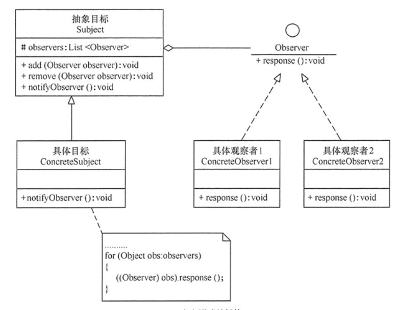

# 观察者模式

## 设计目标
实时反馈所有球NBA球员上场时间

## 组件
- 抽象类
1. subject: 注册中心抽象，管理所有观察者
2. observe: 观察者抽象，所有观察者的方法：

- 具体实现：
1. playground：球场，有ArrayList数组，存入上场球员，移除下场球员
    - Onboard：存入上场球员
    - Offboard：移除下场球员
    - notify：通知所有观察者更新时间
    
2. PlayerX: 具体球员，自带上场时间统计onTime跟随球场变化计时
    - updateOnGround
    
## 组件关系
